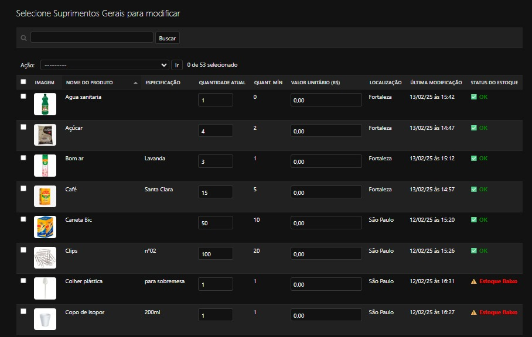
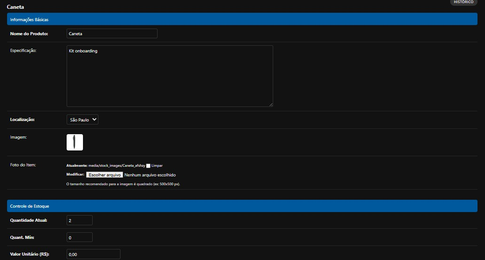

# Case de Estudo: Sistema de Gestão de Estoque (DevStock)
 

---

### Nota sobre o Código-Fonte e Confidencialidade
Este repositório serve como um "case de estudo" para um sistema que desenvolvi profissionalmente. Com a devida autorização da empresa, o código-fonte original foi alterado para remover toda e qualquer informação sensível ou de propriedade intelectual.

A versão aqui presente utiliza uma identidade visual modificada e um banco de dados com informações fictícias, com o único propósito de demonstrar minhas habilidades técnicas para fins de portfólio.

### O Problema de Negócio
A empresa realizava o controle de múltiplos estoques através de planilhas, o que gerava desafios como:
* **Falta de Visibilidade em Tempo Real:** Dificuldade para as diferentes sedes da empresa terem uma visão centralizada e atualizada dos suprimentos.
* **Erros de Contagem:** A entrada manual de dados resultava em inconsistências no planejamento de compras.
* **Controle de Nível Mínimo:** Ausência de um sistema proativo para alertar sobre a necessidade de reposição de itens.

### A Solução: DevStock
Para resolver estes problemas, desenvolvi um sistema de gestão de estoque centralizado utilizando Python e Django. A solução foi projetada para ser uma ferramenta interna robusta e intuitiva para o time de Recursos Humanos.

### Funcionalidades Principais
* **Gestão de Múltiplos Estoques:** O sistema permite a criação e gerenciamento de diferentes categorias de estoque (ex: "Estoque de Escritório", "Suprimentos Gerais").
* **Controle de Acesso por Usuário:** Utilizando o sistema de autenticação e autorização do Django para que apenas usuários autorizados pudessem modificar o estoque.
* **Filtros Avançados:** A interface permite filtrar os itens por localização (sede de São Paulo, Fortaleza, etc.), facilitando a logística entre as filiais.
* **Sistema de Alerta Automático:** Implementação de um script em Python que monitora o banco de dados e, ao identificar que um item atingiu sua "Quantidade Mínima", dispara automaticamente um e-mail de alerta para o responsável, utilizando a biblioteca `smtplib`.

### Arquitetura e Tecnologias
O projeto foi construído sobre o framework Django, com um foco especial na modelagem de dados e na customização do painel de administração.
* **Models Complexos:** Foram criados modelos com diferentes tipos de relacionamentos para representar a estrutura de estoques, produtos e localizações.
* **Django Admin:** O painel de administração do Django foi extensivamente utilizado e customizado para servir como a interface principal do sistema.

### Demonstração

**Fluxo de Edição de Estoque (GIF)**

**Telas do Sistema (Prints)**

*Tela da lista de produtos, com filtros e status de estoque:*

*Tela de edição de um produto específico:*

